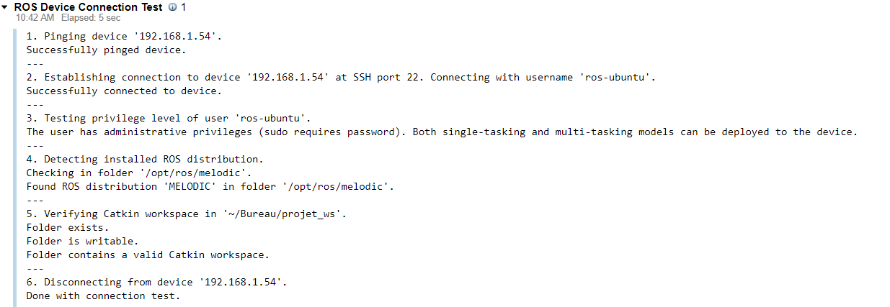

# Network using ROS

Le but est de se connecter à la raspberry via la wifi afin de lancer les nodes et recevoir les informations, topics et service venant de celle ci et de lui en renvoyé.

Connaitre les ip adresse
rapsberry pi: 

```shell
ifconfig
```
configure ssh:
```shell
/etc/init.d/ssh stop
sudo /etc/bin/ssh-keygen -A
/etc/init.d/ssh start
sudo systemctl status ssh
```

PC windows
SI vous utiliser un terminal ubuntu, faire la même ligne de commande et trouve l'ip addresse dans le meme réseau.

```shell
estelle@DESKTOP-K3CV3BK:/mnt/d/Documents/2_CPE/4_A5/shared_folder/s5_g7_briand_guy_kahan_martinez$ ifconfig
eth2: flags=4163<UP,BROADCAST,RUNNING,MULTICAST>  mtu 1500
        inet 192.168.56.1  netmask 255.255.255.0  broadcast 192.168.56.255
        inet6 fe80::580b:946b:97ec:85b9  prefixlen 64  scopeid 0xfd<compat,link,site,host>
        ether 0a:00:27:00:00:04  (Ethernet)
        RX packets 0  bytes 0 (0.0 B)
        RX errors 0  dropped 0  overruns 0  frame 0
        TX packets 0  bytes 0 (0.0 B)
        TX errors 0  dropped 0 overruns 0  carrier 0  collisions 0

lo: flags=73<UP,LOOPBACK,RUNNING>  mtu 1500
        inet 127.0.0.1  netmask 255.0.0.0
        inet6 ::1  prefixlen 128  scopeid 0xfe<compat,link,site,host>
        loop  (Local Loopback)
        RX packets 0  bytes 0 (0.0 B)
        RX errors 0  dropped 0  overruns 0  frame 0
        TX packets 0  bytes 0 (0.0 B)
        TX errors 0  dropped 0 overruns 0  carrier 0  collisions 0

wifi0: flags=4163<UP,BROADCAST,RUNNING,MULTICAST>  mtu 1500
        inet 192.168.1.29  netmask 255.255.255.0  broadcast 192.168.1.255
        inet6 fe80::8034:3ba2:65ee:72c9  prefixlen 64  scopeid 0xfd<compat,link,site,host>
        ether 9c:da:3e:9c:8f:c9  (Ethernet)
        RX packets 0  bytes 0 (0.0 B)
        RX errors 0  dropped 0  overruns 0  frame 0
        TX packets 0  bytes 0 (0.0 B)
        TX errors 0  dropped 0 overruns 0  carrier 0  collisions 0

wifi2: flags=4163<UP,BROADCAST,RUNNING,MULTICAST>  mtu 1500
        inet 192.168.137.1  netmask 255.255.255.0  broadcast 192.168.137.255
        inet6 fe80::8472:a703:6802:fb8c  prefixlen 64  scopeid 0xfd<compat,link,site,host>
        ether 9e:da:3e:9c:8f:c9  (Ethernet)
        RX packets 0  bytes 0 (0.0 B)
        RX errors 0  dropped 0  overruns 0  frame 0
        TX packets 0  bytes 0 (0.0 B)
        TX errors 0  dropped 0 overruns 0  carrier 0  collisions 0
```

On obtient:

PC : 192.168.1.29

raspberry pi : ros-ubuntu@192.168.1.54

# Matlab
Sur simulink:
Cliquer sur "Apps-->Robot Operating System(ROS)"
choisir le premier ROS
Il faut à présent configurer le réseau et l'accès au workspace de notre projet. Selectionner "remember my password" pour faciliter la connection à l'avenir.


Faites un test, vous deviez avoir les ligne suivantes:


Si problème de connection, reportez vous à la section "Problèmes possibles", un peu plus bas.

# Problèmes possibles

## la raspberry ne repond pas au ping sur windows:
cela peut etre du au firewall sur la rasbberry.
Pour supprimer toute les règles et partir sur les règles par défaut:
```
sudo iptables -F
```
https://vitux.com/how-to-block-allow-ping-using-iptables-in-ubuntu/

## 